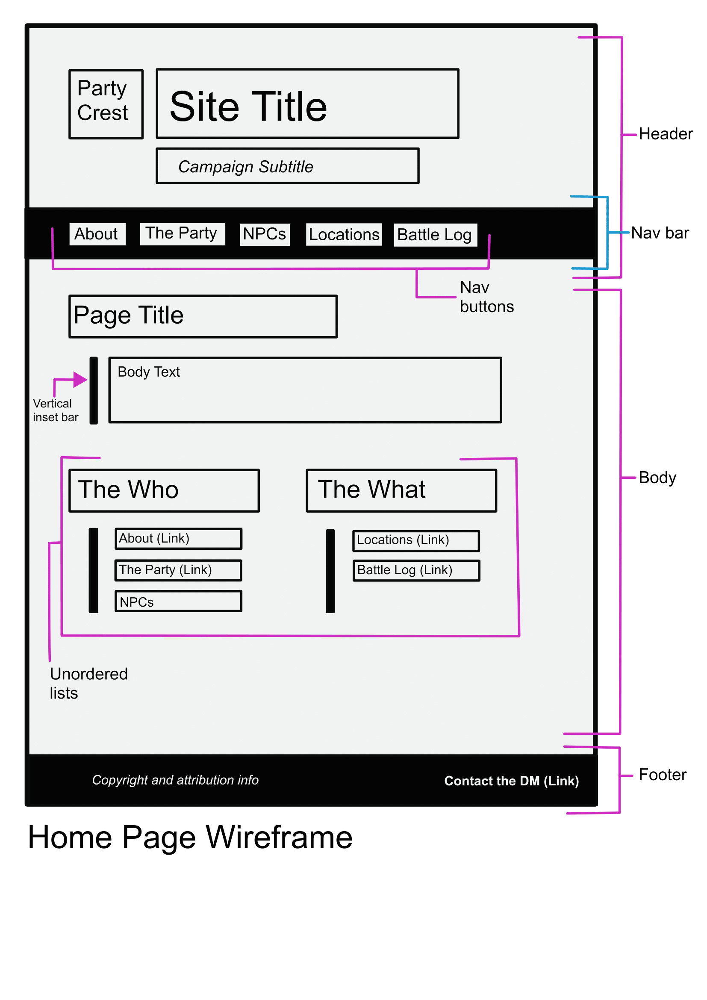
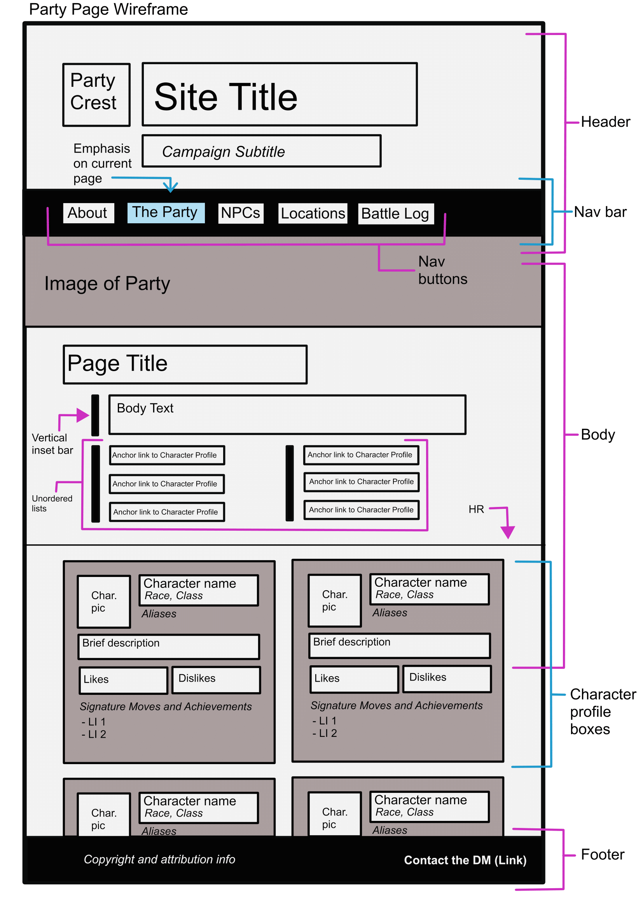
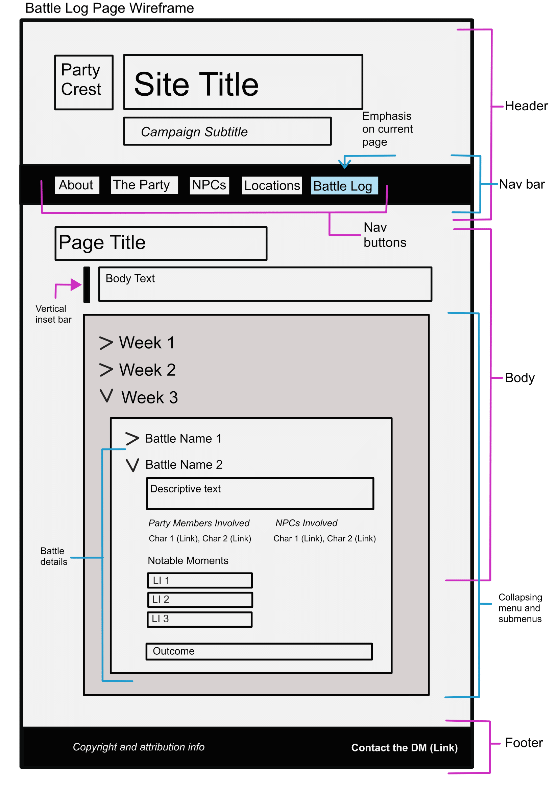

# Caroline Breul's INF6420 Project
This website serves as a resource for my DnD party, and will document the various characters/monsters/items/locations/events relevant to our current campaign in one streamlined site. Right now, the party's notes are sparse and usually in random Google docs, so this will serve as a "version of record" for our campaign's documentation.

## Wireframes
These wireframes are for the home page, the main Party page, and the Battle Log page. The Party page will most likely serve as the template for the NPC/Monster page as well.

### Header, Footer, Navigation
All three pages (and all of the pages on the site I have planned) will have the same header, footer, and navigation bar/menu.

#### Header
The header will have the party's logo, name, and a subtitle specifying the campaign we are currently on.

#### Navigation
Running just below the header is a horizonal navigation bar, containing buttons to the other pages on the site. The current page will be highlighted in the nav bar in some way.

#### Footer
The footer will contain copyright and any additional attribution information needed, as well as a mailto: contact email.

### Home Page Wireframe
---

This page will be fairly basic, but include a basic intro to the party, campaign, and the purpose of the site. It will also contain navigational links, essentially as the navigation bar does.

### Party Page Wireframe
---

This page will have an image of the party as a whole, and a series of anchor links at the top of the page to allow users to jump to different members of the party. Each party member will have their own profile "block", which includes a thumbnail profile image, some key details about the character, and so on. Users can scroll down the page or use the anchor links to navigate the page.

### Battle Log Wireframe
---

The Battle Log will serve as a record of all encounters and events the party has in-game, documenting key outcomes, items won/found, and any notable moments. The battles will be presented chronologically, by week, in an expanding menu. Each week can be clicked on, and the menu will expand to display the battles/encounters that occured in that week in-game. Each individual battle/encounter can then be clicked on to display further details, such as who/what was involved (which will all be linked to their respective profiles on the Party Page/NPCs page), the location, the outcome, etc.
